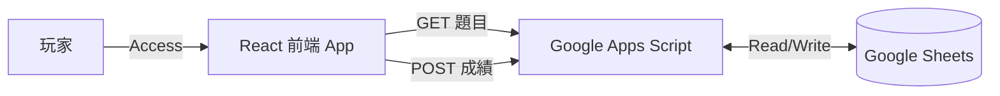

# 復古風 Pixel Art 闖關問答遊戲開發實錄

這份文件記錄了如何從零開始打造一個結合「復古街機風格」與「Google Sheets 後台」的互動網頁遊戲。適合分享給對 React 開發、Google Apps Script 應用或獨立遊戲開發感興趣的技術社群。

---

## 1. 專案發想與目標 (Concept)

### 核心需求
- **風格**：2000 年代復古街機 (Pixel Art)，強調樸實但有設計感的視覺。
- **互動**：闖關制問答遊戲，需計算成績與過關判定。
- **後台**：非技術人員也能輕鬆維護的題庫系統 (Google Sheets)。

### 架構亮點
- **無伺服器 (Serverless)**：完全不需要傳統後端伺服器，直接利用 Google 生態系。
- **即時更新**：修改 Google Sheets 內容，遊戲題目即時同步。
- **低成本**：前端可託管於任何靜態空間 (GitHub Pages/Vercel)，後端使用免費的 Google 額度。

---

## 2. 技術選型 (Tech Stack)

| 領域 | 技術/工具 | 選擇原因 |
|:---:|:---|:---|
| **Frontend** | React 19 + Vite | 現代化開發體驗，組件化管理 UI 狀態。 |
| **Language** | JavaScript (ES6+) | 快速開發，生態系豐富。 |
| **Styling** | CSS Variables + Global Styles | 手刻 Pixel Art 樣式，不依賴龐大 UI 框架以保持輕量與風格純粹。 |
| **Backend** | Google Apps Script (GAS) | 原生整合 Google Sheets，可部署為 Web API。 |
| **Database** | Google Sheets | 作為資料庫，易於編輯與檢視數據。 |
| **Assets** | DiceBear API (Pixel Art) | 動態生成高達 100+ 種獨特的像素風關主頭像。 |

---

## 3. 系統架構設計 (Architecture)



### 資料流
1. **初始化**：前端啟動，透過 `GET` 請求向 GAS 撈取題目。
2. **遊戲中**：前端負責所有互動邏輯（計時、計分、動畫）。
3. **結算**：遊戲結束，前端將成績與 User ID 透過 `POST` 回傳 GAS，寫入 Sheet。

---

## 4. 關鍵實作細節 (Implementation Highlights)

### 4.1 像素風格的達成 (Visuals)
為了達成純正的像素感，我們在全域 CSS 做了幾項關鍵設定：
- **字體**：引入 Google Fonts `'Press Start 2P'`，這是經典的 8-bit 遊戲字體。
- **渲染**：設定 `image-rendering: pixelated;`，確保圖片放大時不會模糊，而是呈現清晰的鋸齒邊緣。
- **UI 元件**：不使用圓角 (border-radius)，而是利用 `box-shadow` 模擬出像素邊框與立體感。

```css
/* 經典的像素陰影按鈕效果 */
.pixel-btn:active {
  transform: translate(2px, 2px);
  box-shadow: 2px 2px 0px 0px rgba(0,0,0,0.5);
}
```

### 4.2 後端 API 實作 (Google Apps Script)
利用 GAS 的 `doGet` 與 `doPost` 函式來處理 HTTP 請求。
- **GET**：讀取「題目」工作表，隨機洗牌後回傳 N 題。
- **POST**：接收 JSON 格式的成績，搜尋使用者 ID，若存在則更新累計數據，不存在則新增。

### 4.3 狀態管理與邏輯 (React Logic)
使用 React 的 `useState` 與 `useEffect` 管理遊戲生命週期：
- `Login`：驗證 ID。
- `Game`：核心循環，處理題目載入、倒數、答題回饋。
- `Result`：顯示結果並觸發資料上傳。

### 4.4 遊戲體驗升級 (Game Juice) - Phase 2
為了提升互動感，我們在第二階段加入了音效與視覺特效：

#### 音效引擎 (Audio Engine)
不依賴外部 mp3 檔案，而是使用 **Web Audio API** 原生合成 8-bit 音效。這保持了專案零資源依賴 (Zero Assets) 的特性。
- **OscillatorNode**：使用 `square` 與 `sawtooth` 波形合成嗶聲、鈴聲與爆炸聲。
- **GainNode**：控制音量衰減 (Envelope)，模擬打擊感。

#### 視覺特效 (Visual Effects)
- **CSS Animation**：定義 `@keyframes shake`，在答錯時讓容器劇烈震動。
- **Canvas Confetti**：引入輕量級 `canvas-confetti` 函式庫，在通關時噴發慶祝彩帶。

---

## 5. 開發挑戰與解決方案 (Challenges & Solutions)

在開發過程中，我們遇到並解決了幾個有趣的前端工程問題：

### 🔴 挑戰 1：React StrictMode 導致的「題目瞬跳」
- **現象**：遊戲開始時，題目會先顯示 A，0.5 秒後突然跳成題目 B。
- **原因**：React 18+ 在開發模式下會執行兩次 `useEffect`，導致發出了兩次 API 請求。由於後端是「隨機」出題，兩次請求回傳的題目不同。第一次請求先回來渲染了畫面，緊接著第二次請求回來覆蓋了它。
- **解法**：實作 **Race Condition 防護機制**。在 `useEffect` 中加入 `ignore` 旗標，確保只有最後一次有效請求 (Effect Cleanup) 會更新狀態。

```javascript
useEffect(() => {
    let ignore = false;
    // fetch logic...
    if (!ignore) setQuestions(data);
    return () => { ignore = true; }; // Cleanup
}, []);
```

### 🔴 挑戰 2：點擊穿透 (Ghost Clicks)
- **現象**：在首頁點擊「開始」後，瞬間誤觸了遊戲畫面的「選項 A」，導致第一題直接被系統判定作答。
- **原因**：使用者點擊開始時通常會連點，或手指未及時抬起，事件在組件切換瞬間傳遞到了新出現的按鈕上。
- **解法**：
  1. **輸入冷卻 (Input Cooldown)**：在遊戲載入後強制加入 1 秒的 `inputDisabled` 狀態。
  2. **視覺回饋**：冷卻期間按鈕呈現灰色 (Disabled)，提示使用者稍安勿躁。

### 🔴 挑戰 3：跨域請求 (CORS) 與資料傳輸
- **現象**：直接 POST JSON 到 GAS 有時會遇到 CORS 預檢 (Preflight) 失敗或資料解析錯誤。
- **解法**：雖然我們最終使用了 `ContentService.MimeType.JSON` 成功處理，但在除錯過程中，我們確保了 GAS 腳本權限設定為 `Anyone`，並正確處理 `e.parameter` 來解析 Payload。

---

## 6. 成果總結

本專案成功在極短時間內（約 1 小時）完成開發與部署。它證明了：
1. **風格化不需依賴大框架**：簡單的 CSS 變數就能營造強烈視覺風格。
2. **Google Sheets 是強大的 CMS**：對於輕量級遊戲，它是最快、最方便的後端選擇。
3. **體驗細節決定成敗**：像「防抖動」、「防止重複請求」這些看不見的細節，才是讓 Web App 感覺像 Native App 的關鍵。

---

## 7. 優化路線圖 (Optimization Roadmap)

為了將專案推向產品級水準，我們已規劃以下優化方向，可作為後續開發參考：

### 🎮 遊戲體驗升級 (Game Juice)
- **Audio Engine**：加入 8-bit 背景音樂 (BGM) 與互動音效 (SFX，如答對叮咚聲、答錯爆炸聲)。
- **Visual Effects**：實作答錯震動 (Screen Shake) 與過關彩帶 (Confetti) 特效，增強打擊感。
- **Transitions**：加入關卡切換的過場動畫。

### ⚡ 效能與架構優化
- **Image Preloading**：在答題冷卻期間預先載入下一關圖片，解決網路延遲導致的閃爍問題。
- **PWA Support**：加入 `manifest.json` 與 Service Worker，支援「加入主畫面」與離線遊玩。

### 🏆 機制擴充
- **Leaderboard**：利用現有的 Google Sheets 數據製作「名人堂」，顯示前 5 名高分玩家。
- **Countdown Timer**：加入每題倒數機制，增加緊張感。

---
*Created by Antigravity Agent & User*
